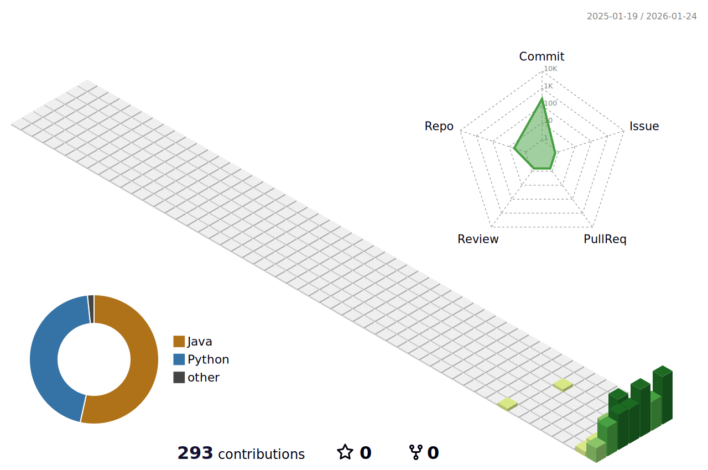

# 👋 Hello, I'm Jeong Hyeonjin

# Haneul's Record

  

  

### 🏆 GitHub Trophies

  

---

### 🧑‍💻 About Me
- 🎓 **Education**: SSAFY 15th (Gumi Campus)
- 🎯 **Focus**: 
- 💡 **Interests**: Edutech, Fintech

---

### 🛠 Tech Stack

  
  

---

### 📋 Solved.ac Profile

  

---

### 🟢 My 3D Contributions

---

### 📊 GitHub Stats

  
  

---

### 📬 Contact Me

  

